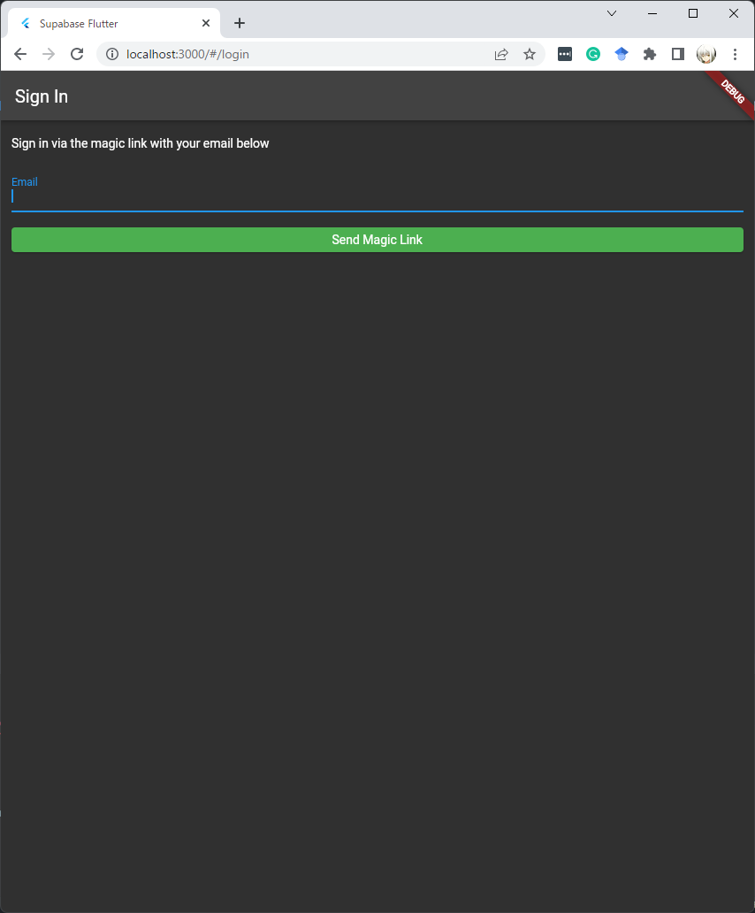
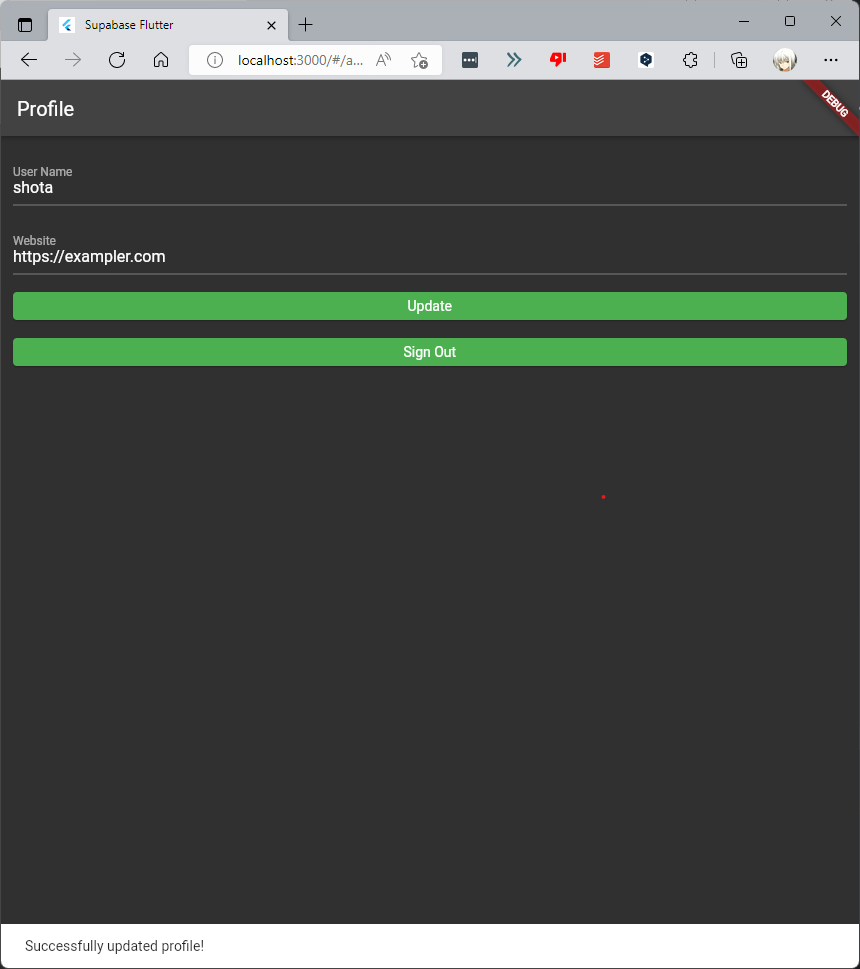

# Sample Application for Flutter and Supabase

SupabaseとFlutterで開発したサンプル版WEBアプリ。

本リポジトリで行うことは次の通り。

* マジックリンクを使ってSupabase Authでユーザにサインインする
* Supabaseデータベースのデータ保存と取得

# セットアップ

## 新規プロジェクト作成

1. [app.supabase.com](app.supabase.com)にアクセスする
2. 「New Project」をクリック
3. プロジェクトの詳細を入力
4. 新規データベースが出来上がるのをそのまま待機する

## データベースの新規作成

1. 「SQL」をクリック
2. 「User Management Starter」をクリック
3. 「Run」をクリック

▼使用するSQLファイル

```sql
-- Create a table for public "profiles"
create table profiles (
  id uuid references auth.users not null,
  updated_at timestamp with time zone,
  username text unique,
  avatar_url text,
  website text,

  primary key (id),
  unique(username),
  constraint username_length check (char_length(username) >= 3)
);

alter table profiles enable row level security;

create policy "Public profiles are viewable by everyone."
  on profiles for select
  using ( true );

create policy "Users can insert their own profile."
  on profiles for insert
  with check ( auth.uid() = id );

create policy "Users can update own profile."
  on profiles for update
  using ( auth.uid() = id );

-- Set up Realtime!
begin;
  drop publication if exists supabase_realtime;
  create publication supabase_realtime;
commit;
alter publication supabase_realtime add table profiles;

-- Set up Storage!
insert into storage.buckets (id, name, public)
values ('avatars', 'avatars', true);

create policy "Anyone can upload an avatar."
  on storage.objects for insert
  with check ( bucket_id = 'avatars' );
```

## APIキーの取得

1. 「Setting」をクリック
2. サイドバーにある「API」をクリック
3. APIのURLと「anon」のキーが発行される

# Flutterアプリの作成

## `lib`フォルダのリポジトリ

```powershell
C:.
│  generated_plugin_registrant.dart
│  main.dart
│  
├─components
│      auth_required_state.dart
│      auth_state.dart
│      
├─pages
│      account_page.dart
│      login_page.dart
│      splash_page.dart
│
└─utils
        constants.dart
```

## プロジェクトの新規作成

まずは以下のコマンドで新規プロジェクトを作成する。

```powershell
flutter create supabase_quickstart
```

あと、FlutterでSupabaseを操作するのに必要なパッケージである`supabase_flutter`をインポートする

```powershell
flutter pub add supabase_flutter
```

## 主要機能のインポート

本プロジェクトの`lib/main.dart`にSupabaseクライアントを初期化する。

`lib/main.dart`

```dart
import 'package:flutter/material.dart';
import 'package:supabase_flutter/supabase_flutter.dart';

Future<void> main() async {
  WidgetsFlutterBinding.ensureInitialized();

  await Supabase.initialize(
    url: '[YOUR_SUPABASE_URL]',
    anonKey: '[YOUR_SUPABASE_ANON_KEY]',
  );
  runApp(MyApp());
}
```

## 認証機能の実装

`supabase_flutter`プラグインには`SupabaseAuthState`クラスが存在するので、これを継承することで多種多様なディープリンクに対応できる。

`lib/components/auth_state.dart`

```dart
import 'package:flutter/material.dart';
import 'package:supabase/supabase.dart';
import 'package:supabase_flutter/supabase_flutter.dart';
import 'package:supabase_quickstart/utils/constants.dart';

class AuthState<T extends StatefulWidget> extends SupabaseAuthState<T> {
  @override
  void onUnauthenticated() {
    if (mounted) {
      Navigator.of(context).pushNamedAndRemoveUntil('/login', (route) => false);
    }
  }

  @override
  void onAuthenticated(Session session) {
    if (mounted) {
      Navigator.of(context)
          .pushNamedAndRemoveUntil('/account', (route) => false);
    }
  }

  @override
  void onPasswordRecovery(Session session) {}

  @override
  void onErrorAuthenticating(String message) {
    context.showErrorSnackBar(message: message);
  }
}
```

## 認証必須の状態管理の実装

ユーザがサインインしている場合にのみ、特定のページを表示したいことがある。そのような場合には、便利な`AuthRequiredState`クラスを作成して、ユーザの認証が必要なページに対してそれを継承できる。`AuthRequiredState`は`supabase_flutter`で提供されている`SupabaseAuthRequiredState`を継承する。

`lib/components/auth_required_state.dart`

```dart
import 'package:flutter/material.dart';
import 'package:supabase_flutter/supabase_flutter.dart';

class AuthRequiredState<T extends StatefulWidget>
    extends SupabaseAuthRequiredState<T> {
  @override
  void onUnauthenticated() {
    if (mounted) {
      Navigator.of(context).pushNamedAndRemoveUntil('/login', (route) => false);
    }
  }
}
```

また、`Supabase`クライアントを使いやすくするために定数ファイルを作成する。また、1行のコードでshowSnackBarを呼び出すための拡張メソッド宣言を追加で入れておく。

`ib/utils/constants.dart`

```dart
import 'package:flutter/material.dart';
import 'package:supabase_flutter/supabase_flutter.dart';

final supabase = Supabase.instance.client;

extension ShowSnackBar on BuildContext {
  void showSnackBar({
    required String message,
    Color backgroundColor = Colors.white,
  }) {
    ScaffoldMessenger.of(this).showSnackBar(SnackBar(
      content: Text(message),
      backgroundColor: backgroundColor,
    ));
  }

  void showErrorSnackBar({required String message}) {
    showSnackBar(message: message, backgroundColor: Colors.red);
  }
}
```

## `Splash Screen`の作成

アプリを開いた直後にユーザに表示される`Splash Screen`を作成する。この`Splash Screen`は`AuthState`を継承しているので、ユーザの認証状態に応じて適切なページにリダイレクトするようになっている。

`lib/pages/splash_page.dart`

```dart
import 'package:flutter/material.dart';
import 'package:supabase_quickstart/components/auth_state.dart';

class SplashPage extends StatefulWidget {
  const SplashPage({Key? key}) : super(key: key);

  @override
  _SplashPageState createState() => _SplashPageState();
}

class _SplashPageState extends AuthState<SplashPage> {
  @override
  void initState() {
    recoverSupabaseSession();
    super.initState();
  }

  @override
  Widget build(BuildContext context) {
    return const Scaffold(
      body: Center(child: CircularProgressIndicator()),
    );
  }
}
```

## ログインページの作成

ログインとサインアップを管理するためのFlutterウィジェットを作成する。マジックリンクを使うので、ユーザはパスワードを使わずにメールでサインインできる。また、本ページはユーザのログインを処理するため、`AuthState`を継承する。

`lib/pages/login_page.dart`

```dart
import 'package:flutter/foundation.dart';
import 'package:flutter/material.dart';
import 'package:supabase/supabase.dart';
import 'package:supabase_quickstart/components/auth_state.dart';
import 'package:supabase_quickstart/utils/constants.dart';

class LoginPage extends StatefulWidget {
  const LoginPage({Key? key}) : super(key: key);

  @override
  _LoginPageState createState() => _LoginPageState();
}

class _LoginPageState extends AuthState<LoginPage> {
  bool _isLoading = false;
  late final TextEditingController _emailController;

  Future<void> _signIn() async {
    setState(() {
      _isLoading = true;
    });
    final response = await supabase.auth.signIn(
        email: _emailController.text,
        options: AuthOptions(
            redirectTo: kIsWeb
                ? null
                : 'io.supabase.flutterquickstart://login-callback/'));
    final error = response.error;
    if (error != null) {
      context.showErrorSnackBar(message: error.message);
    } else {
      context.showSnackBar(message: 'Check your email for login link!');
      _emailController.clear();
    }

    setState(() {
      _isLoading = false;
    });
  }

  @override
  void initState() {
    super.initState();
    _emailController = TextEditingController();
  }

  @override
  void dispose() {
    _emailController.dispose();
    super.dispose();
  }

  @override
  Widget build(BuildContext context) {
    return Scaffold(
      appBar: AppBar(title: const Text('Sign In')),
      body: ListView(
        padding: const EdgeInsets.symmetric(vertical: 18, horizontal: 12),
        children: [
          const Text('Sign in via the magic link with your email below'),
          const SizedBox(height: 18),
          TextFormField(
            controller: _emailController,
            decoration: const InputDecoration(labelText: 'Email'),
          ),
          const SizedBox(height: 18),
          ElevatedButton(
            onPressed: _isLoading ? null : _signIn,
            child: Text(_isLoading ? 'Loading' : 'Send Magic Link'),
          ),
        ],
      ),
    );
  }
}
```

## アカウントページの作成

ユーザがサインインした後、プロフィールの詳細を編集したり、アカウントを管理したりできるようにする。そのために、`account_page.dart`という新しいウィジェットを作成する。このページを表示するにはユーザが認証されている必要があるので、このページは`AuthRequiredState`を継承していることには十分に留意すること。

`lib/pages/account_pages.dart`

```dart
import 'package:flutter/material.dart';
import 'package:supabase/supabase.dart';
import 'package:supabase_quickstart/components/auth_required_state.dart';
import 'package:supabase_quickstart/utils/constants.dart';

class AccountPage extends StatefulWidget {
  const AccountPage({Key? key}) : super(key: key);

  @override
  _AccountPageState createState() => _AccountPageState();
}

class _AccountPageState extends AuthRequiredState<AccountPage> {
  final _usernameController = TextEditingController();
  final _websiteController = TextEditingController();
  var _loading = false;

  /// Called once a user id is received within `onAuthenticated()`
  Future<void> _getProfile(String userId) async {
    setState(() {
      _loading = true;
    });
    final response = await supabase
        .from('profiles')
        .select()
        .eq('id', userId)
        .single()
        .execute();
    final error = response.error;
    if (error != null && response.status != 406) {
      context.showErrorSnackBar(message: error.message);
    }
    final data = response.data;
    if (data != null) {
      _usernameController.text = (data['username'] ?? '') as String;
      _websiteController.text = (data['website'] ?? '') as String;
    }
    setState(() {
      _loading = false;
    });
  }

  /// Called when user taps `Update` button
  Future<void> _updateProfile() async {
    setState(() {
      _loading = true;
    });
    final userName = _usernameController.text;
    final website = _websiteController.text;
    final user = supabase.auth.currentUser;
    final updates = {
      'id': user!.id,
      'username': userName,
      'website': website,
      'updated_at': DateTime.now().toIso8601String(),
    };
    final response = await supabase.from('profiles').upsert(updates).execute();
    final error = response.error;
    if (error != null) {
      context.showErrorSnackBar(message: error.message);
    } else {
      context.showSnackBar(message: 'Successfully updated profile!');
    }
    setState(() {
      _loading = false;
    });
  }

  Future<void> _signOut() async {
    final response = await supabase.auth.signOut();
    final error = response.error;
    if (error != null) {
      context.showErrorSnackBar(message: error.message);
    }
  }

  @override
  void onAuthenticated(Session session) {
    final user = session.user;
    if (user != null) {
      _getProfile(user.id);
    }
  }

  @override
  void dispose() {
    _usernameController.dispose();
    _websiteController.dispose();
    super.dispose();
  }

  @override
  Widget build(BuildContext context) {
    return Scaffold(
      appBar: AppBar(title: const Text('Profile')),
      body: ListView(
        padding: const EdgeInsets.symmetric(vertical: 18, horizontal: 12),
        children: [
          TextFormField(
            controller: _usernameController,
            decoration: const InputDecoration(labelText: 'User Name'),
          ),
          const SizedBox(height: 18),
          TextFormField(
            controller: _websiteController,
            decoration: const InputDecoration(labelText: 'Website'),
          ),
          const SizedBox(height: 18),
          ElevatedButton(
              onPressed: _updateProfile,
              child: Text(_loading ? 'Saving...' : 'Update')),
          const SizedBox(height: 18),
          ElevatedButton(onPressed: _signOut, child: const Text('Sign Out')),
        ],
      ),
    );
  }
}
```

## 最後に

`lib/main.dart`を以下のように編集する。

```dart
import 'package:flutter/material.dart';
import 'package:supabase_flutter/supabase_flutter.dart';
import 'package:supabase_quickstart/pages/account_page.dart';
import 'package:supabase_quickstart/pages/login_page.dart';
import 'package:supabase_quickstart/pages/splash_page.dart';

Future<void> main() async {
  WidgetsFlutterBinding.ensureInitialized();

  await Supabase.initialize(
    // TODO: Replace credentials with your own
    url: '[YOUR_SUPABASE_URL]',
    anonKey: '[YOUR_SUPABASE_ANNON_KEY]',
  );
  runApp(MyApp());
}

class MyApp extends StatelessWidget {
  @override
  Widget build(BuildContext context) {
    return MaterialApp(
      title: 'Supabase Flutter',
      theme: ThemeData.dark().copyWith(
        primaryColor: Colors.green,
        elevatedButtonTheme: ElevatedButtonThemeData(
          style: ElevatedButton.styleFrom(
            onPrimary: Colors.white,
            primary: Colors.green,
          ),
        ),
      ),
      initialRoute: '/',
      routes: <String, WidgetBuilder>{
        '/': (_) => const SplashPage(),
        '/login': (_) => const LoginPage(),
        '/account': (_) => const AccountPage(),
      },
    );
  }
}
```

# 完成デモ





# 開発環境

* Visual Studio Code 1.64
* Windows 11
* Flutter 3(web version)
* Supabase